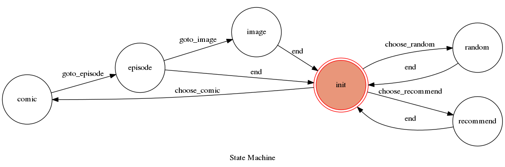

# TOC Project 2019

## Finata State Machine

## Usage
The initial state is set to `init`.
The state will change when user input. Not every input is going to get an reply. The action of state machine depends on user's input.
This bot app is going to parse `https://www.cartoonmad.com/` and try to search as well as display a comic for you.
This bot app has deployed on heroku.

* init
	* Input: "random"
		* Action: App will goto state `random`
		* Reply : No Reply 
	* Input: "recommand"
		* Action: App will goto state `recommand`
		* Reply : No Reply
	* Input: "comic"
		* Action: App will goto state `comic`
		* Reply : No Reply
* random
	* Input: "start"
		* Action: App will search `https://www.cartoonmad.com/` and find a comic randomly
		* Reply : Name of the comic that app randomly picked
	* Input: "end"
		* Action: App will go back to state `init`
		* Reply : No Reply
* recommand
	* Input: "start"
		* Action: App will search `https://www.cartoonmad.com/`'s home page and return all recommendations
		* Reply : All recommendations found on `https://www.cartoonmad.com/`'s home page
	* Input: "end"
		* Action: App will go back to state `init`
		* Reply : No Reply
* comic
	* Input: Comic which you want to read
		* Action: App will search `https://www.cartoonmad.com/` and try to find the given comic, if it find it then App will return all episodes available and goto state `episode`. If there exist multiple results, App will return all possible results and stay in state `comic` waiting for next input of desired comic.
		* Reply : Comic's available episodes or all possible result matches given comic name
* episode
	* Input: which episode you want to read
		* Action: If the given episode is available, App will return first page of the given episode and goto state `image`. Otherwise, App will return "sorry, cant get image, please choose another comic" and go back to state `init`
		* Reply : image of comic page or none
	* Input: "end"
		* Action: App will go back to state `init`
		* Reply : No Reply
* image
	* Input: "next"
		* Action: App will return image of next page
		* Reply : Image
	* Input: "end"
		* Action: App will go back to state `init`
		* Reply : No Reply 
